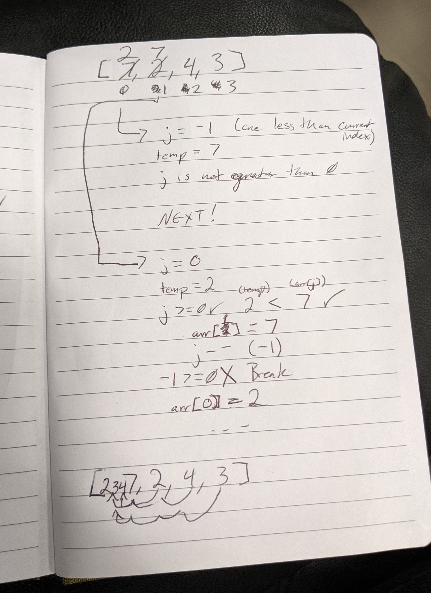

# Lecture Notes: Insertion Sort

Insertion sort takes an element in an array and "moves" it to its appropriate place. By going through each item in 
the list and checking it to the previous item, we can determine if it's in the correct place and move it if necessary. 

Since we have to visit each element individually and the potentially revist all previous elements as we sort our 
current element, this is not the most 
efficient sorting algorithm. We will get into how other algorithms approach this problem later.  

## Learning Objectives

- Understand what the Insertion Sort algorithm is
- Understand the theory behind Insertion Sort
- Be able to implement Insertion Sort. 

## Lecture Flow

- Draw out a visual of what Insertion Sort is and how it moves elements.
    - Includes and array and lots of arrows.
- Go into more detail with pseudo code. 
    - Lay out the for loop and while loop structure.
    - Explain how the temp variable and index tracking ensures that values aren't overwritten.

## Diagram

## Algorithm

For this method, we want to go through each element and check if it is smaller than the element to the left. 

If it is smaller, we want to keep moving it to the left until we find either a value that isn't bigger than it, or 
until we find the beginning of the list. 

Then we repeat for the next element in the list. 

## Pseudocode

(Taken from the Codefellows assignment)

      InsertionSort(int[] arr)
      
        FOR i = 1 to arr.length
        
          int j <-- i - 1
          int temp <-- arr[i]
          
          WHILE j >= 0 AND temp < arr[j]
            arr[j + 1] <-- arr[j]
            j <-- j - 1
            
          arr[j + 1] <-- temp

## Readings and References

Read [this breakdown from Geeks for Geeks](https://www.geeksforgeeks.org/insertion-sort/)

If you are a more visual learner, you can watch [this video from Harvard's CS50](https://youtu.be/O0VbBkUvriI?t=87)

You can also use [this study guide from Harvard](https://study.cs50.net/insertion_sort) as a quick reference. 